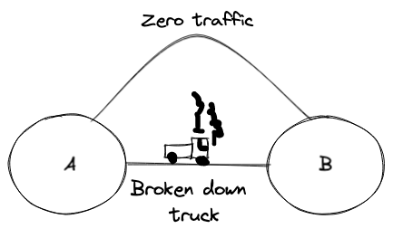
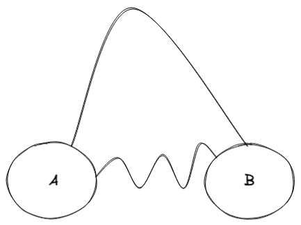
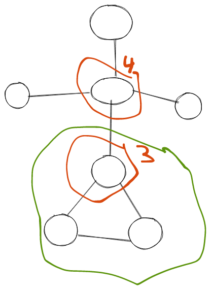
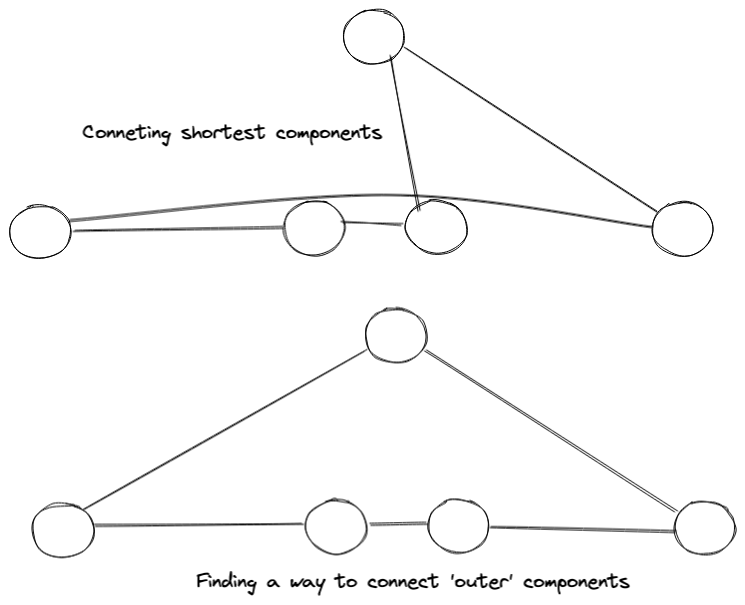
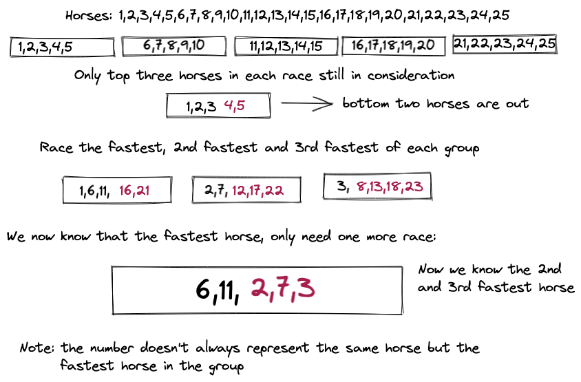

# 1.10 Exercises
## Finding Counter Examples
### 1-1
> Show that `a + b` can be less than `min(a,b)`

If we take negative values, such as `a =-1, b=-2`,
then `min(a,b) = -2` and `a+b = -3`.
### 1-2
>Show that `a x b` can be less than `min(a,b)`

If one value is `0` and the other negative such as `a=-1, b=0` then `min(a,b) = -1` but the product is `0`.

### 1-3
> Design/draw a road network with two points `a` and `b` such that the fastest route between `a` and `b` is not the shorted route



### 1-4
> Design/draw a road network with two points `a` and `b` such that the shortest route between $a$ and `b` is not the route with the fewest turns



### 1-5

>The knapsack problem is as follows: given a set `S` of subsets `S_1,...,S_M` and a target number `T`, find a subset of `S` that adds up exactly to `T`. For example, there exists a subset within `S = {1,2,5,9,10}` that adds up to `T = 22` but not `T = 23`. Find counterexamples to each of the following algorithms for the knapsack problem. That is, give an `S` and `T` where the algorithm does not find a solution that leaves the kanpsack completely full, even though a full-knapsack solution exists.

> (a) Put the elements of S in the knapsack in left to right order if they fit, that is the first-fit algoritm

S = {4,5,10} T = 10

> (b) Put the elements of S in the knapsack from smallest to largest, that is the best fit algorithm

S = {1,2,3,7} T = 9

> (c) Put the elements of S in the knapsack from largest to smallest.

S = {7,8,14} T = 15

### 1-6

>The set cover problem is as follows: given a set S of subsets S_1,...,S_m of the universal set U = {1,...,n}, find the smallest subset of subsets T ⊆ S such that the union of sets t = U. For example, consider the subsets S_1 = {1,3,5}, S_2 = {2,4}, S_3 = {1,4}, and S_4 = {2,5}. The set cover of {1,...,5} would then be S_1 and S_2. Find a counterexample for the following algorithm: Select the largest subset for the cover, and then delete all its elements from the universal set. Repeat by adding the subset containing the largest number of unocvered elements until all are covered.


Consider U = {1,2,3,4, 5} subsets {1,2,3} {1,2,5} {3,4}

Since the largest set here has a choice of two, it can choose {1,2,3} and the rest sets become:

{5} and {4}, picks {5} and then {4} to get {1,2,3,4,5} covered.

However the optimal is {1,2,5} and {3,4}

### 1-7

>The maximum clique problem in a graph G = (V, E) asks for the largest subset C of vertices V such that there is an edge E between every pair of vertices in C. Find a counterexample for the following algorithm: Sort the vertices of G from highest to lowest degree. Considering the vertices in order of degree, for each vertex add it to the clique if it is a neighbour of all vertices currently in the clique, repeat until all vertices have been considered.




The algorithm wil find a clique of two (nodes in red) and not the optimal clique of three (in green).


## Proofs of correctness

### 1-8

> Prove the correctness of the following recursive algorithm to multiply two natural numbers, for all integer constants c >= 2.

```
Multiply(y,z)
	if z = 0 then return(0) else
	return(Multiply(cy, ⌊z/c⌋) + y · (z mod c))
```

>For when z = 0

Multiply(y,0) = 0

> For when z = 1

Multiply(y,1) = Multiply(cy, 0) + y(1 mod c) = 0 + y = y;

> For when z = 2

Multiply(y,2) = Multiply(cy, ⌊z/c⌋) + y(z mod c)

which for c =2 is:

Multiply(y,2) = Multiply(2y, 1) + y(2 mod 2) = 2y + 0 = 2y

for when c >2 :

Multiply(y,2) = Multiply(cy, 0) + y(c mod 2) = 0 + cy = cy

> Assume z == c

Multiply(y,c) = Multiply(yc, 1) + y (c mod c) = yc;

> Assume z < c

Multiply(y, z) = Multiply(yc, 0) + y * z = yz;

> Assume z > c

Multiply(y, c+1) = Mutiply(cy, 1) + y (c+1 mod c) = cy + y = y(c+1)

> c is 2 is proven, prove c>2

Multiply(y, c+2) = Multiply(cy, 2) + y(2) = cy + 2y = c(y+2)

> Prove 2c-1 

Multiply(y, 2c-1) = Multiply(cy, 1), y(c-1) = cy + y(c-1) = y(2c-1)

> Prove nc

Mutiply(y, nc) = Multiply(cy, n), y(0) = Multiply(cy, n)

Multiply(y nc+x) = Multiply(cy, n) + y(nc+x mod c) = Multiply(cy, n) + yx

which will then eventually reduce to nc < 2c and qed


or alternatively prove Multiply(y,z) == Multiply(z,y) and with above it proves it.

Proof needs some work to make it concise

### 1-9

Prove the correctness of the following algorithm for evaluating a polynomial:

a_nx^n + a_(n-1)x^(n-1) + ... + a_1x + a_0.

```
	Horner(a, x)
		p = a_n
		for i from n-1 to 0
			p = p*x + a_i
		return p;
```

> For when n = 0

p = a_0

> For when n = 1

p_1 = a_1 * x + a_0

> for when n = 2

p_2 = (a_2 * x + a_1) * x + a_0

> for when n -1:

p_(n-1) = ((a_(n-1) *  x + a_(n-2)) * x + a_(n-3)) * x .... + a_0


Proof needs work

### 1-10

Prove the correctness of the following sorting algorithm.

```
Bubblesort(A)
	for i from n to 1
		for j from i to i-1
			if(A[j] > A[j+1])
				swap the values of A[j] and A[j+1]
```

> For an empty []

returns []

> For a single item [x]

returns sorted [x]


> For two items [x,y]

swaps x,y if x >y, and returns a sorted list

> For three items [x,y,z]

places lowest value in [x,_,_] first position and then sorts the other two

and so on...


### 1-11

The greatest common divisor of positive integers x and y is the largest integer d such that d divides x and d divides y. Euclids algorithm to compute gcd(x, y) where x > y reduces the task to a smaller problem:

gcd(x, y) = gcd(y, x mod y)


//TODO

## Induction

### 1-12

Prove that the sum of 1...n i = n(n+1)/2 for n>= 0, by induction.

> for n = 1

sum is 1(1+1) /2 = 1

> for n = 2

sum is 2(2+1)/2 = 3

> for n = n + 1

n+1(n+2) / 2 should eq n(n+1)/2 + n+1

(n^2 + 3n + 2) / 2 = (n^2 + n) / 2 + n + 1

n^2 + 3n + 2 = n^2 + n + 2n + 2

n^2 + 2n +2 = n^2 + 3n + 2


### 1-13

Prove that the sun of 1...n i^2 = n(n+1)(2n+1)/6 for n>=0 by induction

> for n = 1

1(1+1)(2+1)/6 = 6/6 = 1

> for n = 2

2(2+1)(4+1)/6 = 30/6 = 5

> assume n-1 is correct, test for n:

n(n+1)(2n+1)/6 = n-1(n-1+1)(2(n-1)+1)/6  + (n)^2

(n^2+n)(2n+1)/6 = (n^2-n)(2n -1)/6 + n^2

(n^2+n)(2n+1) = (n^2-n)(2n-1) + 6n^2

2n^3 + n^2 + 2n^2 + n = 2n^3 -n^2 -2n^2 + n + 6n^2

2n^3 + 3n^2 + n = 2n^3 + 3n^2 + n


### 1-14

Prove that sum of 1...n i^3 = n^2(n+1)^2/4 for n>=0 by induction

> for n = 1

1^2(1+1)^2 / 4

2^2 / 4 = 1

> for n = 2

2^2(2+1)^2/4

4(3)^2/4

36/4 = 9

>for n+1

(n+1)^2(n+2)^2/4 = n^2(n+1)^2/4 + (n+1)^3

(n+1)^2(n+2)^2 = n^2(n+1)^2 + 4(n+1)^2(n+1)

(n+1)^2(n+2)^2 = (n+1)^2 (n^2 + 4(n+1))

(n+2)^2 = n^2 + 4n + 4

n^2 + 2n + 2n + 4 = n^2 + 4n + 4

### 1-15

Prove that the sum of 1...n i(i+1)(i+2) = n(n+1)(n+2)(n+3)/4


> for i = 1

1(2)(3) = 1(1+1)(1+2)(1+3)/4

6 = 2(3)(4)/4

6 = 24/4

> for i = 2

6 + 2(3)(4) = 2(3)(4)(5)/4

30 = 120/4

> assume n-1 is true, prove for n


n-1(n)(n+1)(n+2)/4 + n(n+1)(n+2) = n(n+1)(n+2)(n+3)/4

n(n+1)(n+2) ((n-1)/4 + 1) = n(n+1)(n+2)(n+3)/4

(n-1)/4 + 1 = (n+3)/4

(n-1) + 4 = n+3

n+3 = n+3

### 1-16

Prove by induction on n>= 1 that for every a != 1

sum i=0...n a^i = (a^(n+1) - 1) / (a-1)

>for n = 1

a^0 + a^1 = (a^(1+1) - 1) / (a-1)

a + 1 = (a^2 - 1) / (a-1)

(a+1)(a-1) = (a^2 - 1)

a^2 +a -a -1 = a^2 - 1


>for n = 2


a^0 + a^1 + a^2 = (a^(3) - 1) / (a-1)

a^2 + a + 1 = (a^3 - 1) / (a-1)

(a^2 + a + 1) (a-1) = a^3 - 1

a^3 + a^2 +a - a^2 -a -1 = a^3 - 1

a^3 -1 = a^3 - 1


>assume n-1 true, prove for n

(a^(n-1+1) - 1) / (a-1) + a^n = (a^(n+1) - 1) / (a-1)

(a^n - 1) / (a-1) + a^n = (a^(n+1) - 1) / (a-1)


a^n -1 + a^n(a-1) = a^(n+1) - 1

a^n(1 + (a-1)) - 1 = a^(n+1) - 1

a^n(a) - 1 = a^(n+1) - 1

a^(n+1) - 1 = a^(n+1) - 1


### 1-17

Prove by induction that for n>= 1

The sum of 1...n 1 / (i(i+1)) = n / (n+1)

> for i = 1

1 / (1(2)) = 1 / (1+1)

1/2 = 1/2

> for i = 2

1/2 + 1 / (2(3)) = 2 / (2+1)

1/2 + 1/6 = 2/3

3/6 + 1/6 = 2/3

4/6 = 2/3

> assume n-1 true, prove n

(n-1) / n +  1 / (n(n+1)) = n / n+1

(n-1) / n + 1/(n^2 + n) = n / n+1

n/n - 1/n + 1/(n(n + 1)) = n / (n+1)

(n+1) - (n+1)/n + 1/n = n

n(n+1) - (n+1) + 1 = n^2

n^2 + n -n - 1 + 1 = n^2

n^2 = n^2


### 1-18

Prove by induction that n^3+2n is divisible by 3 for all n>= 0

> For n = 0

0^3 + 2 ^0 = 0 which is divisible by 3

> For n=1

1^3 + 2 = 3

> For n = 2

2^3 + 4 = 12

> Assume true for n-1, assume there is 3 x multiple on previous

(n-1)^3 + 2(n-1) + 3x = n^3 + 2n

(n-1)(n-1)(n-1) + 2n - 2 + 3x = n^3 + 2n

(n^2 -2n + 1)(n-1) - 2 + 3x = n^3

n^3 - 2n^2 + n - n^2 + 2n -1 -2 + 3x = n^3

n^3 - 3n^2 + 3n - 3 + 3x = n^3

-3n^2 + 3n -3 + 3x = 0

3x = 3n^2 -3n + 3

Thus showing the difference between n-1 and n is a multiple of 3

### 1-19

Prove by induction that a tree with n vertices has exactly n-1 edges


> for n = 1

One node so no edges to connect anything

> for n = 2

Parent node connects to child with 1 edge

> assume true for n-1, test for n

if (n-2) edges on graph with n-1 vertices, adding a new vertice will mean one more connection to the three, hence n-1 edges

### 1-20

Prove by indcution that the sum of the cubes of the first of the first n positive integers is equal to the square of the sum of these integers

e.g. i_0^2 + i_1^3 .... + i_n^3 = (i_0 + i_1 + ... + i_n)^2

> for n = 1

1^3 = 1^2

1 = 1

> for n = 2

1^3 + 2^3 = (1+2)^2

1+8 = 9

9 = 9

> assume true for n prove  for n+1

sum(n)^2 + (n+1)^3 = sum(n+1)^2

(n + n-1 + .... + 1)^2 + (n+1)^3 = (n+1 + n + ... + 1)^2

sum(n)^2 + (n+1)^3 = (n+1 + sum(n))^2

sum(n)^2 + (n+1)^3 = (n+1 + sum(n))(n+1 + sum(n))

sum(n)^2 + (n+1)^3 = (n+1)^2 + 2(n+1)sum(n) + sum(n)^2

(n+1)^3 = (n+1)^2 + 2(n+1)sum(n)

(n+1)^2 = (n+1) + 2(sum(n))

n^2 + 2n + 1 = 2sum(n) + n + 1

n^2 + n = 2sum(n)

(n^2 + n) / 2 = sum(n)

cheat here and we say we know this is true as it's the formula for the sum, perhaps better way to prove this.
 
## Estimation

### 1-21

 > Do all the books you own total at least one million pages?

No probably not, even at 1000 books at an average page of roughly 300 each, that would be 300,000

### 1-22

How many words are there in this textbook?

roughly 800 pages, 20 words in a small block, 20 blocks per page. So roughly 400(800) = roughly 320,000.

### 1-23

> How many hours in a million seconds? (Do all calculations in your head)

60 seconds a minute, 3600 seconds in an hour, 1,000,000 / 3,600 = 10,000/36 = bit less than 300, bit more than 250, roughly 280/

> How many days?

Based on previous 280/24 = roughly 11

### 1-24 

> Estimate how many cities and towns in the US

There are roughly 50 states, and a 300,000,000 population

assume even distribution of people in states, 6,000,000 per state, Assume average town/city holds 6000, estimate 1000 towns and cities per state.

so 50,000 towns and cities.

> note: Looking up the answer, gave 20,000 cities and towns and villages in the us in 2018, average population per town/city is far lower

### 1-25

> Estimate how many cubic miles of water flow out of the mouth of the Missipi River each day. Do not look up any supplmental facts. Describe all assumptions.

My lack of knowledge on US geography is showing here, I can base my guesses on seeing Niagara falls in person and assume the flow rate is roughly similar. A cubic mile seems like an absolute vast amount to fill even if you collected it at the bottom of Niagara falls. Rough guess is maybe half an hour to an hour to fill such a space. But that would be 20 cubic miles a day which sounds utterly wrong, so I'll multiply it by a 100 and guess 2000

> Looking it up :  16,792 cubic meters (593,003 cubic feet) of water per second into the Gulf of Mexico which would mean 16,792 by 60 by 60 by 24 = 1450828800 cubic meters per day which is 0.34807234 cubic miles, so I suppose I heavily underestimated the cubic mile.

### 1-26

> How many Starbucks or McDonalds locations are there in your country?

Basing the answer of the previous where there are about 20,000 towns in the US for a roughly 300,000,000 population, and the UK has about a 5th of the size of that, so lets assume 4,000 towns in the UK (I recognise the land in the US per person is higher), so we'll half that to 2,000 towns in the UK and estimate 1/4 towns have a McDonalds/StarBucks so guess 500

> There are actually 1300 mcdonalds in the uk and 1000 starbucks

### 1-27

> How long would it take to empty a bathrub with a drinking straw?

Assume you are drinking at a rate of a litre per minute, Assume 50 litres for a bath, based on a person weighing 50kg might need 50litres of water for a bath. so 50 minutes

### 1-28

> Is disk drive accessed normally measured i milliseconds (thousandth of a second) or microseconds (millionths of a second)?

I would say microseconds, since you can see harddrives advertised with 320Kb/s read/write speeds, meaning over 300,000 reads per second, more than 1 a millisecond.


> Does your RAM memory access a word in more or less than a microsecond?

Assuming word here is the 32 bit word definition: I would say less than a microsecond


How many instructions can your CPU execute in one year if the machine is left running all the time?

assume 3GHz processor, so 3 Giga operations per second, multiply by 60 and 60 and 24 and 365 gives roughly 95 Peta cycles, assuming one operation per 3 cycles, then 30 Peta operations.

### 1-29

> A sorting algortihm takes 1 second to sort 1,000 items on your achine, How long will it take to sort 10,000 items

>If you belive the algorithm is proportional to n^2

1000^2 operations gives 10 seconds

compared to 10,000^2, or 100x increase of 1000 seconds.

>If algorithm is proportional to nlog(n)

1000 log(1000) = 10 seconds
1000 x 3 = 10 seconds

change to

10000 x 4 = 40,000 / 3000 = 13x increase so 130 seconds


## Implementation Projects

### 1-30

> Implement the two TSP heuristics of Section 1.1 (page 5). Which of them give better solutions in practice? Can you devise a heuristic that works better than both of them?

Example written on Godbolt, note, you can use an unordered_set for the routes, but then you'll have to write a hashing function for a `std::pair<int32_t, int32_t>`.

```cpp
#include <cmath>
#include <iostream>
#include <utility>
#include <list>
#include <vector>
#include <set>
#include <limits>
#include <numeric>

using point = std::pair<int32_t, int32_t>;

std::set<point> routes {
    {0, 0},
    {10, 0},
    {10, 10},
    {20, 10},
    {30, 0},
    {20, -10},
    {10, -20},
    {0, -30},
};

double getDistance(point const& p1, point const& p2)
{
   auto const [x1, y1] = p1;
   auto const [x2, y2] = p2;
   
   return std::sqrt(std::pow(x2-x1,2) + std::pow(y2-y1, 2));
}

std::vector<point> NearestNeighbour(std::set<point> destinations)
{
    // Pick an initial point
    std::vector<point> myroute{*destinations.cbegin()};
    std::set<point> visited{*destinations.cbegin()};

    // Delete the initial point from consideration
    destinations.erase(destinations.begin());

    while(!destinations.empty()) {
        double min_dist = std::numeric_limits<double>::max();
        auto point_to_add = destinations.begin();

        // For each remaining point
        for(auto iter = destinations.begin(); iter != destinations.end(); ++iter) {
            // Get distance to existing point in route
            for(auto const& point : myroute)
            {
                auto dist = getDistance(point, *iter);
                if(dist < min_dist) {
                    min_dist = dist;
                    point_to_add = iter;
                }
            }
        }

        // Add the closest point
        myroute.push_back(*point_to_add);
        // Remove that point from consideration
        destinations.erase(point_to_add);
    }

    std::cout << "Route is : " << std::endl;
    for(auto const &[x,y] : myroute) {
        std::cout << " " << x << "\t" << y << std::endl;
    }

    return myroute;
}

std::list<point> ClosestPair(std::set<point> destinations)
{
    double min_dist = std::numeric_limits<double>::max();
    auto point_one = destinations.begin();
    auto point_two = destinations.begin();

    // start off by finding the two closest points
    for(auto iter = destinations.begin(); iter != destinations.end(); ++iter)
    {
        for(auto second_iter = destinations.begin(); second_iter != destinations.end(); ++second_iter)
        {
            if(iter == second_iter) {
                continue;
            }

            auto const dist = getDistance(*iter, *second_iter);

            if(dist < min_dist) {
                min_dist = dist;
                point_one = iter;
                point_two = second_iter;
            }
        }
    }

    std::list<point> path{*point_one, *point_two};
    
    std::cout << "starting with : " << point_one->first << " " << point_one->second << std::endl;
    std::cout << "and : " << point_two->first << " " << point_two->second << std::endl;

    destinations.erase(point_one);
    destinations.erase(point_two);

    while(!destinations.empty())
    {
        bool add_to_front = true;
        auto min_dist = std::numeric_limits<double>::max();
        auto point_to_add = destinations.begin();

        for(auto iter = destinations.begin(); iter != destinations.end(); ++iter)
        {
            auto const dist_to_front = getDistance(path.front(), *iter);
            auto const dist_to_back = getDistance(path.back(), *iter);

            add_to_front = dist_to_front <= dist_to_back;

            if(add_to_front) {
                if(dist_to_front < min_dist) {
                    min_dist = dist_to_front;
                    point_to_add = iter;
                }
            } else {
                if(dist_to_back < min_dist) {
                    min_dist = dist_to_back;
                    point_to_add = iter;
                }
            }
        }

        if(add_to_front) {
            path.push_front(*point_to_add);
        } else {
            path.push_back(*point_to_add);
        }

        destinations.erase(point_to_add);
    }

    std::cout << "Route is : " << std::endl;
    for(auto const &[x,y] : path) {
        std::cout << " " << x << "\t" << y << std::endl;
    }

    return path;
}

template<typename T>
double getTotalDist(T const& path)
{
    double total_dist = 0.0;
    auto last_item = path.back();

    for(auto const &item: path) {
        total_dist += getDistance(item, last_item);
        last_item = item;
    }

    return total_dist;
}


int main()
{
    auto const path = NearestNeighbour(routes);
    auto const dist = getTotalDist(path);
    std::cout << "total dist : " << dist << std::endl;

    auto const pathTwo = ClosestPair(routes);
    auto const distTwo = getTotalDist(pathTwo);
    std::cout << "total dist : " << distTwo << std::endl;

    return 0;
}
```

Gives output:

```
Route is : 
 0	-30
 10	-20
 20	-10
 10	0
 0	0
 10	10
 20	10
 30	0
total dist : 133.137
starting with : 0 0
and : 10 0
Route is : 
 0	0
 10	0
 10	10
 20	10
 30	0
 20	-10
 10	-20
 0	-30
total dist : 116.569
```

In this case anyway, ClosestPair is the better choice. Can you derive a heuristic that works better than both of them?

At least this for this example, the closest pair and closest component will be unoptimised on the loop back home. I.e. start at the center of mass of all points and connect points in a clockwise fashion.



Such that a way to optimise backtracking on the final path or connecting outer components as opposed to inner components could lead to a better solution.


### 1-31

> Describe how to test whether a given set of tickets establishes sufficient coverage in the Lotto problem of Section 1.8 (Page 22). Write a program to find good ticket sets.

// TODO


## Interview Problems

### 1-32

> Write a function to perform integer division without using either the / or * operators. Find a fast way to do it.

A slow way could be to loop over the number being divided, subtracting the divisor on each iteration e.g.


```cpp
// Divide x by y
int intdiv(int x, int const y)
{
    int divisions = 0;
    while(x-y >= 0) {
        x -= y;
        ++divisions;
    }
    return divisions;
}
```

Find a fast way to do it:

Some ideas:

* For divison by multiples of two, bitshifting would be quick. e.g. x / 4 would be x >> 2.

Such that `x / 20` would be equivalent to `((x/5) / 2) / 2` Meaning we could factor out any shifts on the divisor before hand. However then doing 6 billion / 21 would still be incredibly slow. So perhaps we can bit shift the divisor up to take the largest chunk possible then bitshift down.

so 200 / 21, would bitshift 21 << to 42, again << to 84 and again << 168, once more to 336. See that it doesn't fit and reverse the process, so 168 goes in once (which is 2^3 of 21) leaving 32, 84 doesnt fit, neither does 42 and down to 21 which is 2^0 shifts, meaning 2^3 + 2^0 = 9 times.

In C++:

```cpp
#include <cmath>

// Divide x by y
int intdiv(int32_t x, int32_t const y)
{
    int32_t divisions = 0;

    if(x < y) {
        divisions = 0;
    } else if (x == y) {
        divisions = 1;
    } else {
        // Find largest multiple of 2 of y that fits in x
        int64_t shifted_y = y;
        int32_t shifts = 0;
        
        while(shifted_y < x) {
            shifted_y <<= 1;
            ++shifts;
        }

        shifted_y >>= 1;
        --shifts;

        // Remove consecutively smaller multiples of 2 of y from x
        while(shifts >= 0) {
            if(x - shifted_y >= 0) {
                x-= shifted_y;
                divisions += powl(2, shifts);
            }
            shifted_y >>= 1;
            --shifts;
        }
    }

    return divisions;
}
```

### 1-33

> There are twenty-five horses. At most, five horses can race together at a time. You must determine the fastest, second fastest and third fastest horses. Find the minimum number of races in which this can be done.

* Each horse has to race, so it makes sense to begin with five races, although that doesn't give you necessarily the five fastest horses, as the three fastest horses could be in the same group, so it eliminates 6 horses.

* To get the fastest horse you could simply race the five winners, and so the fastest horse can be calculated in 6 races, but the 2nd and 3rd fastest horse is what is more tricky to determine.

The perhaps simple solution, is to do 5 races, to get five vectors of {1,2,3,4,5}, then race do another three races

{1,1,1,1,1}, {2,2,2,2,2}, {3,3,3,3,3} and then perform another race of the 2nd and 3rd next of the fastest horse, and the second horse of the second fastest horse in the first group and the third fastest group of the fast group

i.e.

winners {1a,1b,1c,1d,1e} -> then race {2a, 3a, 1b, 2b, 1c}; and you will have all five fastest horses.

Which means you need 9 races. This can be shown as a picture:




### 1-34

> How many piano tuners are there in the entire world?

### 1-35

> How many gas stations are there in the United states?

Roughly 300 million population in the US, let's say a third are of driving age, have a licence and access to a car.
Which means 100 million cars need gas. Let's say a gas station can serve 1000 cars a day. Which would mean 100,000 stations would be needed if every single car had to be refuled right now today which obviously is not the case, we can say that a car has to be fueld every 10 days, would give 10,000 stations. Now recalling the number of towns/villages from the previous question being around 15,000 for the US. Having one gas station every 2 out of three towns sounds about right.

> Looking up the answer reveals that was a 10x underestimation, as there are roughly 150,000 gas stations in the US. Which makes sense in hindsight considering the size of the place.

### 1-36

> How much does the ice in a hockey rink weigh?

I'm showing my lack of hockey knowledge by not knowing how thick the ice is, I'm guessing the ice wil be about 2 inches thick, and say roughly 20 by 40meters. 800m^2 of 2 inches thick or about 800m^2 * 5cm or 0.05m so 40m^3. and we'll say that each metre cubed of ice is 1 Ton, so 40 Tonnes.

> Looking it up it looks like the thickness of the ice is 3/4 inch, but the size is more like 26 * 61m. So I would say 40 Tons is still a reasonable guess

### 1-37

> How many miles of road are there in the United states?

Considering you can drive for about 10 hours on the freeway in Texas and still be in Texas, there is bound to be an enormous amount of road. To make it easier, we can estimate the amount of road in one state and multiply it by fifty.

If we imagine driving for 10 hours at 100km/h, we can estimate a road running east to west in Texas at 1000km. And since Texas is slighlty wider than tall, a guess of 800km tall will do. And now to guess, there is a grid of road, such that there are 800 roads running east to west and 1000 roads running north to south spanning the whole distance. Obviously this isn't the case but it'll serve as a grid of road. so 800 * 1000 + 1000 * 800 = 1,600,000 km of road * 50 makes 80,000,000 km of road.

> Looking it up, there is about 6,500,000 km of road, so out by about a factor of ten. Could probably have accounted for the fact that Texas is a large state and the grid might be an over estimation.

### 1- 38

> On average, how many times would you have to flip open the Manhattan phone book at random in order to find a specific name?

Let's say the phonebook is 1000 pages, and there are two pages when you flip it open (ignoring first and last cover special cases), and so everytime you randomly open the book, you see 2 out of 1000 pages. Meaning a 1/500 probability of finding the name that you want, so an average of 500 times.

## LeetCode

### 1-1 https://leetcode.com/problems/daily-temperatures

O(n) solution, by iterating back from the end, you can keep track of the days with a higher temperature using a vector. I'm unsure how it relates to the chapter unless the intended solution was to use a bubble-sort like algorithm i.e. O(n^2) runtime.

```cpp
class Solution {
public:
    vector<int> dailyTemperatures(vector<int>& temperatures) {
        
        auto const n = temperatures.size();
 
        std::array<int32_t, 71> temps{};
        std::vector<int> results(temperatures.size());
        
        for(int i=n-1; i>=0; --i) {
            auto const temp = temperatures[i];
            temps[temp-30] = i;
            
            
            int32_t next_hottest_day = std::numeric_limits<int32_t>::max();
            
            for(int j= temp+1; j <101; ++j) {
                auto const next_day_temp = temps[j-30];
                
                if(next_day_temp != 0 ) {
                    auto const days_wait = next_day_temp - i;
                    if(days_wait < next_hottest_day) {
                        next_hottest_day = days_wait;
                    }
                }
            }
            results[i] = next_hottest_day == std::numeric_limits<int32_t>::max() ? 0 : next_hottest_day;
        }
        
        return results;
    }
};
```

### 1-2 https://leetcode.com/problems/rotate-list/

```cpp
class Solution {
public:
    ListNode* rotateRight(ListNode* head, int k) {
        // Find number of nodes
        // k mod list size
        // cut the loop at that point for new head
        // Link tail to head

        // Find number of nodes
        ListNode* node = head;
        int32_t n = 0;
        while(node) {
            node = node->next;
            ++n;
        }
       
        if(n < 2 || k < 1) {
            return head;
        }
        
        std::cout << "n : " << n << std::endl;
        
        k = k % n;
        
        std::cout << "rotate by: " << k << std::endl;
        
        if(k==0) {
            return head;
        }
        
        auto steps = n - k;
        
        std::cout << "have to make " << steps << " new head" << std::endl;
        
        node = head;

        while(steps-- > 1) {
            node = node->next;    
        }
        
        auto new_head = node->next;
        node->next = nullptr;
        
        node = new_head;
        while(node->next) {
            node = node->next;
        }
        node->next = head;
        
        return new_head;
        
    }
};

```

### 1-3 https://leetcode.com/problems/wiggle-sort-ii/

A nlog(n) solution, can be done in O(n) however. This way does a sort, then interleaves the smallest and largest half of the ascending array in descending order.

```cpp
class Solution {
public:
    void wiggleSort(vector<int>& nums) {
        vector<int> nums_copy(nums);
        sort(nums_copy.begin(), nums_copy.end());
        
        auto n = nums.size();
        auto mid = n%2==1? n/2 +1 : n/2;
        
        for(int i=0; i< nums.size(); ++i)
        {
            if(i%2 == 0) {
                nums[i] = nums_copy[--mid];
            } else {
                nums[i] = nums_copy[--n];
            }
        }
    }
};
```

## HackerRank

### 1-1 https://www.hackerrank.com/challenges/array-left-rotation

The simplest way is to make a copy, and just index with modulus, could possibly speed it up by doing two large memcpys instead.

```cpp
vector<int> rotateLeft(int d, vector<int> arr) {
    auto const n = arr.size();
    std::vector<int> arr_copy(n);
    
    for(int32_t i=0; i<n; ++i) {
       arr_copy[i] = arr[(i + d) % n];
    }
    
    return arr_copy;
}
```

### 1-2 https://www.hackerrank.com/challenges/kangaroo

Again we can use of the modulus operator and check if both kangaroos meet each other on a whole time step.

```cpp
string kangaroo(int x1, int v1, int x2, int v2) {
    if(x1 > x2 && v1>= v2) {
        return "NO";
    } else if(x2 > x1 && v2 >= v1) {
        return "NO";
    } else {
        //x1 + v1*t == x2 + v2*t
        auto const diff_x = x1 - x2;
        auto const diff_v = v2 -v1;
        return diff_x % diff_v == 0? "YES" : "NO";
    }
}
```

### 1-3 https://www.hackerrank.com/challenges/hackerland-radio-transmitters 

Solution is simple if you consider it similar to the movie scheduling problem described earlier in the chapter.
```cpp
int hackerlandRadioTransmitters(vector<int> x, int k) {
    std::sort(x.begin(), x.end());
    int32_t covered = 0;
    int32_t transmitters = 0;
    
    for(int i=0; i<x.size(); ++i)
    {
        if(x[i] > covered) {
            // item isn't covered by radio, find next item covered by k
            auto index = i;
            
            for(int j=i+1; j<x.size(); ++j) {
                if(x[j] <= x[i] + k) {
                    // can use this house as transmitter
                    index = j;
                } else {
                    break;
                }
            }
            
            ++transmitters;
            covered = x[index] + k;       
        }
    }
    
    return transmitters;
}
```

## Programming Challenges - Online Judge

### 100 - "The 3n+1 Problem"

```cpp
#include <iostream>
#include <vector>
#include <numeric>
#include <unordered_map>

int32_t algorithm(int32_t start) {
    static std::unordered_map<int32_t, int32_t> map;
    if(map.find(start) != map.cend()) {
        return map[start];
    } else {
       int32_t ret = 1;
        if(start != 1) {
            if(start%2==1) {
                ret = 1 + algorithm(start*3 + 1);
            } else {
                ret = 1 + algorithm(start/2);
            }
        }
        map[start] = ret;
        return ret;
    }
}

int32_t getMax(int32_t i, int32_t j)
{
    int32_t max = algorithm(i);
    for(int32_t z=i+1; z<=j; ++z)
    {
        auto const alg = algorithm(z);
        if(alg > max) {
            max = alg;
        }
    }
    return max;
}

int main()
{
    int32_t i;
    int32_t j;

    while(std::cin >> i >> j) {
    	std::cout << i << " " << j << " " << getMax(i, j) << std::endl;
    }

    return 0;
}
```

### 10317 - The Trip

TODO : Needs reformatting to fit OnlineJudge entry and more consideration of rounding to nearest cent

```cpp
#include <iostream>
#include <vector>
#include <functional>

double min_exchange(std::vector<double> costs)
{
    auto const sum = std::accumulate(costs.cbegin(), costs.cend(), 0.0);
    auto const n = costs.size();
    auto const avg = sum / n;

    double above = 0.0;
    double below = 0.0;

    for(auto const& cost : costs) {
        if(cost > avg) {
            above += cost - avg;
        } else {
            below += avg - cost;
        }
    }

    return above;
}

int main()
{
    std::cout << min_exchange({10.0, 20.0, 30.0}) << std::endl;
    std::cout << min_exchange({15.0, 15.01, 3.00, 3.01}) << std::endl;
    return 0;
}
```

output

```
10
12
```

### 10142 - Australian Voting

C++20 solution, written in godbolt, needs adjustment to accept input for onlinejudge submission.

```cpp
#include <iostream>
#include <vector>
#include <numeric>
#include <unordered_map>
#include <algorithm>
#include <list>
int main()
{
    std::vector<std::string> candidates {
       "John Doe",
       "Jane Smith",
       "Sirhan Sirhan",
    };
    // map vote -> vector of list
    std::unordered_map<int32_t, std::vector<std::list<int32_t>>> votes{};
    auto const insert = [&](std::list<int32_t>& l) {
        if(l.empty()) {
            return;
        }
        auto const candidate = l.front();
        l.pop_front();
        if(!l.empty()) {
            // get vector in map and insert
            if(votes.contains(candidate)) {
                votes[candidate].push_back(l);
            } else {
                std::vector<std::list<int32_t>> vec_of_l{l};
                votes[candidate] = vec_of_l;
            }
        }
    };
    std::vector<std::list<int32_t>> ballots {
        {2,1,3},
        {2,1,3},
        {2,3,1},
        {1,2,3},
        {3,1,2},
        // my extras
        {3,1,2},
        {3,1,2},
    };
    for(auto& list: ballots) {
        insert(list);
    }
    auto const totalBallots = ballots.size();
    auto const winner = [&]() {
        for(auto const& [k,v] : votes) {
            auto const percentage = (double) v.size() / totalBallots;
            if(percentage > 0.5) {
                return k-1;
            }
        }
        return -1;
    };
    auto const printVotes = [&]() {
        for(auto const& [k,v] : votes) {
            std::cout << "candidates : " << candidates[k-1] << " " << v.size() << std::endl;
        }
    };
    auto const tied = [&]() {
        return votes.size() > 1 && std::all_of(votes.cbegin(), votes.cend(), [&](auto const& entry) {
            auto const& [k, v] = entry;
            return v.size() == totalBallots / v.size();
        });
    };
    auto const addLeftover =[&](std::list<int32_t>& l) {
        for(;;) {
            if(l.empty()) {
                return;
            }
            auto const candidate = l.front();
            l.pop_front();
            if(votes.contains(candidate)) {
                votes[candidate].push_back(l);
                return;
            }
        }
    };
    bool completed = false;
    int32_t round = 0;
    while(!completed) {
        std::cout << "-----" << "round " << round++ << " -----" << std::endl;
        printVotes();
        auto const winning_candidate = winner();
        if(winning_candidate >= 0) {
            std::cout << "Winner is " << candidates[winning_candidate] << std::endl;
            completed = true;
        } else if (tied()) {
            std::cout << "Tie in votes" << std::endl;
            completed = true;
        } else {
            // find all minimums, remove them
            // create big vector of lists // append them all and remove rest
            auto min = totalBallots;
            for(auto const& [k,v] : votes) {
                min = std::min(min, v.size());
            }
            std::vector<std::list<int32_t>> remaining_votes;
            for(auto iter = votes.begin(); iter != votes.end();) {
                auto const& [k,v] = *iter;
                if(v.size() == min) {
                    // remove candidate from consideration
                    for(auto const& list : v) {
                        remaining_votes.push_back(list);
                    }
                    iter = votes.erase(iter);
                } else {
                    ++iter;
                }
            }
            for(auto& list : remaining_votes) {
                addLeftover(list);
            }
        }
    }
    return 0;
}
```

```
-----round 0 -----
candidates : Sirhan Sirhan 3
candidates : John Doe 1
candidates : Jane Smith 3
-----round 1 -----
candidates : Sirhan Sirhan 3
candidates : Jane Smith 4
Winner is Jane Smith
```


