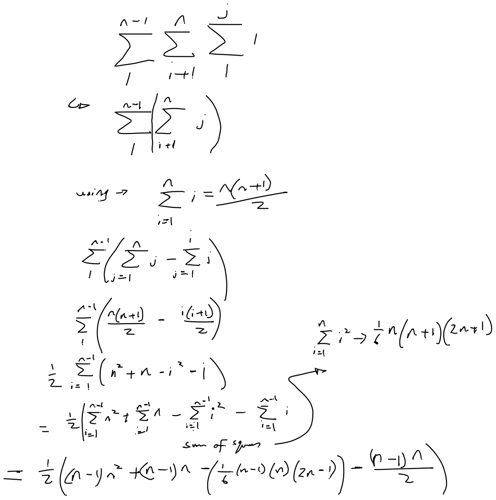
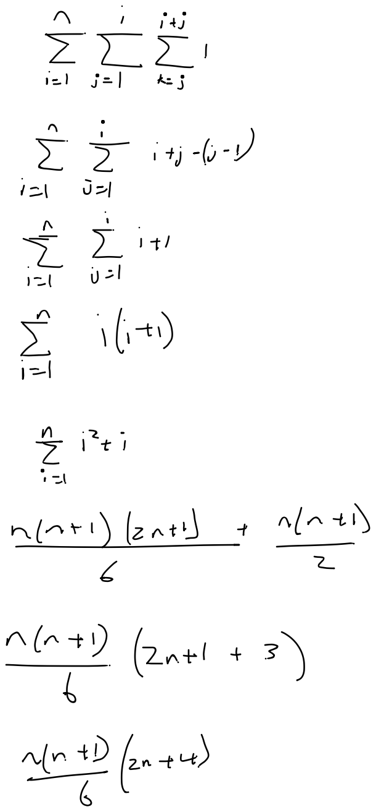

# 2.11
 
## Program Analysis
 
### 2-1 What value is returned by the following function? Express answer as a function of n. Give the worst case running time.
 
```
Mystery(n)
  r = 0
  for i = 1 to n - 1 do
    for j = i+1 to n do
      for k = 1 to j do
        r = r +1
  return r
```


 
 
And you can see that the n^3 term here dominates, so O(n^3)
 
### 2-2 What value is returned by the following function? Express your answer as a function of n. Give worst case running time.
 
```
Pesky(n)
  r = 0
  for i = 1 to n do
    for j = 1 to i do
      for k =j to i+j do
        r = r + 1
  return r
```
 

 
Term grows in relation to n^3, so O(n^3)
 
### 2-3 What value is returned by the following function?
 
```
Pestiferous(n)
  r = 0
  for i = 1 to n do
    for j = 1 to i do
      for j = j to i+j do
 

```
 
 Todo : replace pseudo code with cpp to demonstrate correctness
```
int func(int n) {
    int r = 0;
    for(int i = 1; i<=n; ++i) {
        for(int j=1; j<=i; ++j) {
            for(int k = j; k<=i+j; ++k) {
                r++;
            }
        }
    }
    return r;
}
 
int oldfunc(int n) {
    int r = 0;
 
    for(int i=1; i<=n-1; ++i) {
        for(int j=i+1; j<=n; ++j) {
            r += j;
            /*for(int k=1; k<=j; ++k) {
                ++r;
            }*/
        }
    }
    return r;
}
 
```
 
## Big Oh
 
### 2-8
 
Is 2^(n+1) = O(2^n)?
 
It will be O(2^n) if there exists some c for and some n_0 where for all n> n_0,  2^(n+1) <= c * g(2^n).
 
And 2^(n+1) == 2 * 2^n, and if we take c to be 3 then
 
2^(n+1) <= 3 * 2^n, which will be true for all n>=1.
 
b) Is 2^(2n) = O(2^n)
 
2^(2n) === (2^n)^2,
 
There doesn't exist any constant c for which (2^2n)^2 <= c * 2^n, as for any n > c where c>=1, the equality will not work.
 
### 2-9
 
for each Determine if f(n) is in O,Θ,Ω of g(n) :
 
a) f(n) = log(n^2). g(n) = log(n) + 5
 
Yes for big O:
 
f(n) = 2 log(n) = O(log n)
g(n) = O(log n)
 
Yes for big Omega:
 
f(n) = Ω(log n)
g(n) = Ω(log n)
 
And yes for big Theta as both are a tight boundary.
 
b) f(n) = sqrt(n); g(n) = log(n^2)
 
f(n) = O(sqrt(n)), g(n) = O(log n)
 
So g(n) does not dominate f(n), so f(n) is not in O(g(n))
 
Yes for big Omega:
 
as Ω(log n) works as a lower bound for g(n)
 
No for big Theta:
 
as O(g(n)) isn't an upper bound for f(n)
 
c) f(n) = log^2(n); g(n) = log n
 
f(n) != O(log n), as log^2(n) dominates log(n)
 
f(n) = Ω(log n()) as log(n) works as a lower bound for log^2 n;
 
f(n) != Ω(log^2 n) as f(n) != O(g(n));
 
d) f(n) = n, g(n) = log^2(n)
 
f(n) != O(g(n)), as n dominates log^2(n)
f(n) = Ω(g(n)), as log^2(n) will act as a lower bound on n
f(n) != Θ (g(n)) as f(n) != O(g(n))
 
e) f(n log n + n); g(n) = log(n)
 
f(n) != O(g(n)) as n log n >> log(n)
f(n) = Ω(g(n)) as log(n) << n log n
f(n) != Θ(g(n)) as f(n) != O(g(n))
 
f) f(n) = 10, g(n) = log(10)
 
Both act as constant time, hence O(1) on both.
 
f(n) = O(g(n)) as there exists some c for which 10 <= c * log(10) e.g. c = 100, for all n.
f(n) = Ω(g(n)) as there exists fomr c for which 10 >= c * log(10) e.g. c = 1 for all n
f(n) = Θ(g(n)) as both the above hold true, meaning c_1 * log(10) <= 10 <= c_2 * log(10) for all n.
 
g) f(n) = 2^n; g(n) = 10n^2
 
f(n) != O(g(n)) as 2^n >> n^2
f(n) = Ω(g(n)) as n^2 << 2^n
f(n) != Θ as f(n) != O(g(n))
 
h) f(n) = 2^n; g(n) = 3^n
 
2^n <= c * 3 ^n is true for all n>=1 when c is 1
 
hence f(n) = O(g(n))
 
It is demonstrable that 2^n dominates 3^n
 
as limit->infinity,
 
2^n / 3^n . (2/3)^n, and as n->inf, it tends to zero meaning there will exist no c for which 2^n >= c * 3^n for some constant c that holds as n approaches infinity.
 
Hence f(n) != Ω(g(n))
and 
Hence f(n) != Θ(g(n))
 

### 2-10. For each of the following pairs of functions f(n) and g(n) determine whether f(n) = O(g(n)), g(n) = O(f(n)) or both.
 
a) f(n) = (n^2 - n) / 2, g(n) = 6n
O(f(n)) = n^2, O(g(n)) = n
 
g(n) = O(f(n))
 
b) f(n) = n + 2 sqrt(n), g(n)= n^2
 
O(f(n)) = n
O(g(n)) = n^2
 
hence f = O(g(n))
 
c) f(n) = n log n, g(n) = n sqrt(n) / 2
 
O(f(n)) = n log n
O(g(n)) = n sqrt n
 
f(n) = O(g(n))
 
d) f(n) = n + log n, g(n) = sqrt(n)
 
O(f(n)) = n
O(g(n)) = sqrt(n)
 
g(n) = O(f(n))
 
e) f(n) = 2(log n)^2, g(n) = log n + 1
 
O(f(n)) = log^2(n)
O(g(n)) = log n
 
g(n) = O(f(n)) as log^2 (n) >> log n
 
f) f(n) = 4n log n + n, g(n) = (n^2 - n)/2
 
O(f(n)) = n log n
O(g(n)) = n^2
 
f(n) = O(g(n))
 
### 2-11. For each of the following functions, which of the following asymptotic bounds hold for f(n): O(g(n)), Θ(g(n)), Ω(g(n))?
 
a) f(n) = 3n^2, g(n) = n^2
 
3n^2 <= c * n^2 . e..g c = 4
 
hence f(n) = O(g(n))
 
3n^2 >= c * n^2  e.g. c = 1
 
hence f(n) = Ω(g(n))
 
and thus f(n) = Θ (g(n))
 
b) f(n) = 2n^4 - 3n^2 + 7, g(n) = n^5
 
f(n) = O(g(n)) as 2n^4 - 3n^2 + 7 <= c * n^5 for c = 100 and n>= 1
 
f(n) != Ω(g(n)), as n^5 dominates n^4
 
as (2n^4 - 3n^2 + 7) / n^5  tends to zero as n -> infinity.
 
And hence big Omega doesn't hold true as it doesn't cap the lower bound.
 
c) f(n) = log(n), g(n) = log(n) + 1/n
 
1/n -> 0 as n -> infinity, the dominate term in both is log(n)
 
hence f(n) = O(g(n))
f(n) = Ω(g(n))
f(n) = Θ(g(n))
 
d) f(n) = 2^(k log n), g(n) = n^k
 
f(n) can be written as (2^log(n)) ^ k
 
And so the limit would be
 
(2^log(n))^k / n^k
 
which is (2^log(n) / n) ^ k
 
The inner loop will tend towards 0 as n-> infinity, hence if k is negative,  f(n) dominates g(n) otherwise g(n) dominates f(n).
 
and for k is 0, f(n) = Θ(g(n))
 
e) f(n) = 2^n, g(n) = 2^(2n)
 
g(n) = (2^2)^n = 4^n
 
4^n dominates 2^n,
 
hence f(n) = O(g(n))
 
but f(n) != Ω(g(n)) and f(n) != Θ(g(n))
 
### 2-12 Prove that n^3 - 3n^2 - n + 1 = Θ(n^3)
 
n^3 - 3n^2 - n + 1 <= c * n^3
 
holds true for c=2 for any n>=1
 
n^3 - 3n^2 - n + 1 >= c * n^3 holds true for c = 0.1 and n>= 1000
 
hence there exists some c_1 and c_2 such that c_1 n^3 <= f(n) <= c_2 n^3 for all n > n_0 = max(1,1000)
 
hence n^3 - 3n^2 - n + 1 = Θ(n^3) 
 
### 2-13 Prove that n^2 = O(2^n)
 
n^2 <= c * 2^n
 
log2(n^2) <= log2(c*2^n)
log n <= n (log(2) + log2(c))

log n <= n (1 + log(c))
 
holds true for c = 2 for any n >=1
 
Hence n^2 = O(2^n)
 
### 2-14 Prove or disprove: Θ(n^2) = Θ(n^2 + 1)
 
n^2 + 1 <= c * n^2
 
holds true for c = 2 for any n > 1.
 
Hence n^2+1 = O(n^2)
 
n^2 + 1 >= c * n^2
 
holds true for c = 0.1 for any n >= 0
 
Hence n^2 + 1 = Ω (n^2)
 
Hence Θ(n^2 + 1) = Θ(n^2) 
 
### 2-15 Suppose you have an algoirthm with five running times listed below. How much slower do the algorithms get when you (a) double the input, increase the input size by 1.
 
a) For n^2 to (2n)^2 results in a 4x increase, for a single increase, it increases by (n+1)^2 - n^2 = 2n+1;
 
b) For n^3, a double in size results in a 8x increase as (2n)^3 = 8n^3, for a single increase:
 
(n+1)^3 - n^3 = 3n^2 + 3n + 1
 
c) For 100n^2, a double in size would still be a 4x increase as 100(2n)^2 = 400n^2,
 
// Wrong??
 
100(n+1)^2 - 100n^2 = 100(n^2 + 2n + 1) - 100n^2 = 200n + 100 increase for 1 increase in n;
 
d) n log n
 
if n doubles -> 2n log 2n
 
2n log2n / n log n
 
2 * log_n(2n) increase
 
add 1 = (n+1) log n+1 - n log n
 

e) 2^n
 
2^(2n) = (2^n)^2, hence a 2^n increase when doubling n
 
2^(n+1) = 2 * 2^n, so 2x increase for increase of 1 in n.